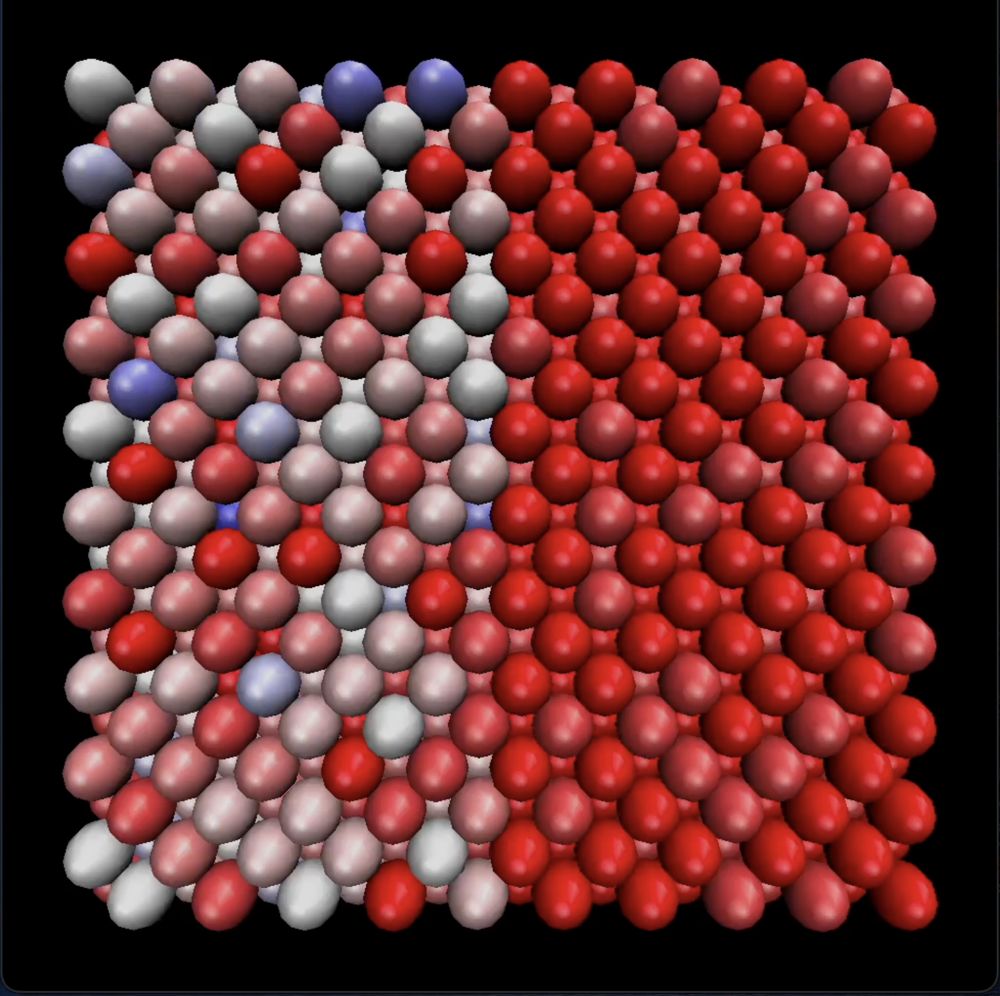

# Temperature Equilibration in Molecular Dynamics Simulation

## Project Description

This project animates temperature equilibration in a molecular dynamics (MD) simulation. The system starts with atoms distributed across a box with varying temperatures, determined by their kinetic energy. One half of the box contains high-kinetic-energy (hot) atoms, while the other half contains low-kinetic-energy (cold) atoms. 

The simulation visualizes the equilibration process, interpolating kinetic energy-based temperatures of atoms over time. Using **VMD (Visual Molecular Dynamics)**, atoms are color-coded from:
- **White**: Lower temperatures
- **Red**: Higher temperatures

A total of **300 frames** are generated to demonstrate the gradual motion of atoms and their temperature convergence.

---

## Workflow

1. **Run `input_script.lmp`**:
   - Generates `dump` and `log.lammps` files containing raw simulation data.

2. **Run `convert_to_xyz.py`**:
   - Converts the LAMMPS `dump` file into an XYZ file (`output.xyz`) containing atom coordinates and kinetic energy values.

3. **Run `xyzTopdb.py`**:
   - Converts the XYZ file into a PDB file (`output_with_ke.pdb`), including kinetic energy values as the B-factor field.

4. **Run `pdb_processing.py`**:
   - Processes the PDB file to assign RGB color values based on the kinetic energy (KE) of each atom.
   - Generates a PDB file (`output_with_rgb.pdb`) with color information.

5. **Run `generate_animation.py`**:
   - Produces **300 static PDB frames** representing the system's state at different time steps.

6. **Run `combinepdbs.py`**:
   - Combines all static PDB files into a single animation-ready PDB file.

7. **Load into VMD**:
   - Upload the final combined PDB file into **VMD** as a new molecule to visualize the animation.

---

## Tools and Technologies

- **LAMMPS** for Molecular Dynamics Simulation
- **Python** for data processing and file format conversions
- **VMD (Visual Molecular Dynamics)** for visualization

---

## Results

### Initial Atom Distribution
Below is the initial distribution of atoms, showing the separation between the hot and cold regions:

### Animation of Temperature Equilibration
The following video demonstrates the equilibration process over time, with atoms transitioning to a uniform temperature:

---

## Key Formulas

1. **Kinetic Energy (KE)**: $\frac{1}{2} m v^2$

   - `m`: Mass of the atom (assumed constant)
   - `v`: Velocity of the atom (from simulation)

2. **RGB Assignment**:
   - Colors range from **Blue (low KE)** to **Red (high KE)**, using linear interpolation:
   \[
   RGB = \text{Map}(\text{KE}, \text{Min\_KE}, \text{Max\_KE}, \text{Color Gradient})
   \]
   - `Min_KE` and `Max_KE` are extracted from the simulation data.
   - The gradient is divided into 5 color categories: Blue, Cyan, Green, Yellow, and Red.

---

